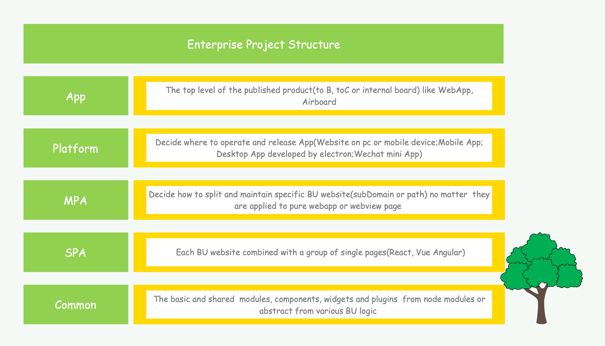
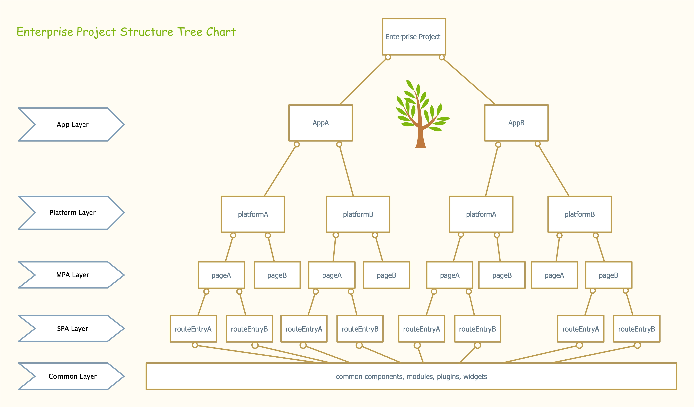
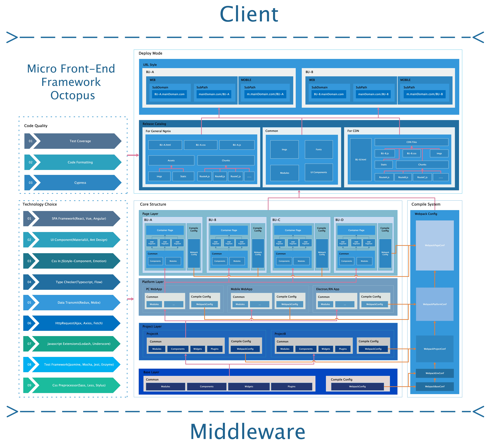

# Octopus Structure  GuideLine

## 1. Project Structure

No matter how complicated an enterprise project is，it is always be combined with several different functionality layer which have relationships of each other. The following picture display the project structure I think the most ideal enterprise project may be.

I think any enterprise project will be split into five layer and named as app, platform, MPA, SPA and common from up to down. In my opinion, the enterprise app combined with at least one client app like our ‘webapp’ and management app like our airboard. So the first level I called ‘app level’ will help us to clarify the published product.

For the client app we need a further definition about which platform it is released.For instance of ‘webapp’, we currently just have the pc platform,but maybe this project will have mobile website or mobile app in the future. So the second layer I called platform,it will help us further split one specific project and offer the extension of platform.

The first and second layer I call them the abstract layer to help us define a specific app. At the begin of the next layer, we kick off to discuss the structure of source codes.Since I advocate to use MPA mode to develop app, the third layer I called MPA that means the specific platform app are combined with several SPA pages. 

The fourth layer is ‘SPA’.In this layer, we decide the routes of the spa and each of them are combined with a variety of components.
During the development, we certainly extract some public components and modules from the specific logic. The components of route entrance are consist of the extracted common logic and feature logic. So the last layer I think is the ‘common’ layer which provide public logic for above layers.
By the way, I put the tree symbol in the right bottom of the picture because actually I think the enterprise project structure like a tree as the following diagram:

With so much technology issues have been discussed, I wanna recommend the front-end framework base on the above discussed content. The framework diagram is shown as followed:

## 2.Octopus Structure Preliminary Design

Overview: The front-end framework consist of three major systems named ‘core structure’, ‘compile system’ and ‘deploy mode’ and two optional systems named ‘code quality’ and ‘technology choice’.In addition, I also put the ‘client’ and ‘middle ware’ layers into the diagram to describe the framework location in details.The middle ware layer can be involved into front-end framework to deal with http request and simple data preprocess and the whole framework I called ‘Mirco front-end service framework’.

So let me introduce the principle and functionality of each part of the framework.The first part as the kernel system is ‘Core Structure’.This system is consisted of four layer and each layer has its own responsibility and in collaboration with each other to build the whole structure.The layer structure is also similar to the enterprise project structure which I mention and make picture above. The only difference occurs on the page layer which the MPA and SPA layer from enterprise project structure are mixed into. In fact, most of the development works focus on this system which determined how to organize our source code structure, how to abstract and extract public logic and response for feature logic calling and how to clarify complicated enterprise project.

The base layer offers a variety of common functionality such as components, modules, widgets and plugins for the above layers, no matter which projects, which platforms or which page containers they are from.And these common functionality come from any of the feature logic, but not included with any of them, it means it only offer developer the pure and abstract logic such as the UI components, language extension and various of node modules.But when a developer practically import these common modules in their business logic,they must obey some regulations which will be discussed until you have got a full picture of the core structure. Now let’s continue to know about the next layer.

The next layer from down to up is ‘project layer’.I list the project-A and project-B to indicate there are many projects which are parallel to each other in this layer and also has a ‘common’ frame in each ‘project’ frame. It means each project has their own common modules to support their above layer no matter platforms and page containers,but independent among projects which restrict us call the common functionality from other projects.

The second layer I called ‘platform’ layer.This layer relates to the medium through which the project is published.Nowadays website has been found prevailed into any platform apps such as pc webapp, mobile webapp, even mobile app which developed by hybrid mode or react-native,and electron app which run as a desktop app.We should extract and clarify specific features from these platform and make common modules for each project developed on them. As the same regulations,developer can’t call the common modules cross platforms.For instance, you will never need to call the mobile UI component while you are developing the pc webapp project.

You may easily find since I have introduced three layers of core structure, but still have not touched any feature logic. It is totally corrective for this feeling that the bottom three layers I regard them as the abstract layer. In these layers, the most works focus on clarify and extract common logic, these are important and essential actions for develop and maintain a stable and extendable project. It's like building a house with a good foundation.Because of so much common frame appeared from each abstract layers, in order to create a reasonable calling chain, I design some regulations for developer to obey.The regulations aren’t able to force developer to obey by program.The major suggestions are about that common frames are strongly relationship between each layer and we are suggested to use the common modules layer by layer, forbid to call these function cross the layers.If you don’t obey these suggestion will cause the circle dependence of each common frame result in a compile error. As a simple way to implement these rules, we can export an index file for each common frame of the below layer, and merge this file with current index file as the new common entrance in current layer.All of the logic codes called common functionality from this new entrance, even each caller don’t know the common frame of below layer.Another obvious regulation is that the common frame of top layer can call the common frame from below, but can not in reverse.

The finial top of the structure is ‘page layer’, which means feature layer.This layer includes MPA and SPA according to app structure diagram.Common frame also exist in each page frame which practically is the spa page container which is combined with a variety of route components.All of the common logic from below layer will be supported to develop these components.   

All of key points of the layers have been introduced except for the compile configurations.We can easily find the major block of each layer such as project A in project layer, mobile webapp in platform layer has a compile configuration which is actually the webpack configuration.These configuration files will be further described in the second major system I called ‘compile system’.

The compile system support developers to design how to compile the project.The ultimate webpack configuration files are merged with several multiple levels webpack configuration files.The top configuration file has the highest priority of all the configuration files mean any configuration within this file will cover the below ones.I defined each configuration file of layer as base, environment, project, platform, and page from down to up.The closer the down is, the closer the configuration is basic, and the closer to the top is, the closer the configuration approach the feature. In a specific layer, all of the webpack configuration files of horizontal block of this layer are merged into one file,it means we must set the name space for each horizontal webpack configuration files, otherwise the options with same key name will be covered with each other which is different from our anticipation.

The last major system is ‘deploy mode’.This system determined how the published project looks like .And it is combined with ‘release catalog’ and ‘URL style’.The first part decided the source code structure of the output,it relates to the static files deployment ways.I list two general method to deploy static files. In the general Ngnix deploy mode,we put the html, js and css files to the same level and two directory ‘assets’ which collect the images and other static, and ‘chunks’ which collect asynchronous route js files.Another deployment method is putting the static files to CDN server.The most different point of this mode is all of the static files are moved into one directory which will be deployed at CDN.We also release the common directory to support all of the released BU directory mentioned above.Only deploy both common and bu directory will let the feature works well.If you want to deploy only one whole directory, it is a simple way to mix the common and bu directory with a little change of the webpack configuration file of release environment.The ‘URL style’ demonstrated how the url looks like for customers.The url in picture is the general form with MPA mode and classify according to sub domain and sub path. 

So much for introducing the major system of front-end framework, we have an overall concept of the whole structure and apply it for practical development.And the last two systems I regard as optional items are ‘code quality’ and ‘technology choice’.Be defined as optional systems don’t mean they are not important and essential, but the core content and structure of this system are dynamic according to the specific features rather than the static structure of other major system.

The first optional system I recommend is in order to promote code quality.We can design coding test and format procedure and import any third tools or plugins to help us improve these behaves.Promoting code quality solutions will be executed during the release process since we can’t complete release actions if code quality system get any errors.Three items listed on the picture are the current processes in webapp.

The second optional system is about technology choice.Since we may have responsibility for several business features and we use MPA mode to develop each business independently .It is better to choose the reasonable and proper technology for every different business.The listed items in technology choice are the general technology issues such as SPA framework, UI components, Data transmit and so on.And the recommended options are also revealed with the issue items.

By the way, I name for the whole micro front-end framework as Octopus which can symbol the features of it. Octopus has many tentacles like the strong extension of framework .Suckers on tentacles offer it firmly adsorb ability symbol the stability of framework.
